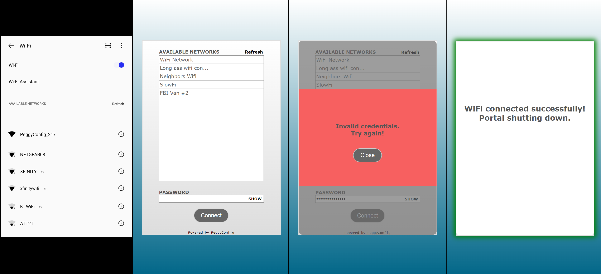

# PeggyConfig
<p align="center">
  
</p>

<br>
<b>PeggyConfig</b> is a captive portal style easy to use network configuration tool for MicroPython IoT projects based on the ESP32 microcontroller.

<br>

<p align="center">
  
  <br><b>Figure 1</b>: PeggyConfig shown in Wi-Fi connections. When selected the user is redirected to the captive portal seen in next 3 pannels from which they can configure the devices Wi-Fi connection.
</p>

## Installation
Copy `PeggyConfig.py` and `index_min.html` into your MicroPython project. This can be done easily with [Thony](https://thonny.org/).

## Setup

There are two 'public' methods that you should use:
* `PeggyConfig.doConfig()` : Blocking method that sets up the access point and starts the captive portal. Returns `True` if successful.
* `PeggyConfig.doConnect()`: Checks if credentials exist on device and tries to connect with them. Returns `True` if successful, `False` if credentials file is not there or credentials are invalid.
### Simple Setup
```python
from PeggyConfig import PeggyConfig

pConfig = PeggyConfig()
#Start captive portal and connect
connected = pConfig.doConfig() # blocking, returns True when sucessful network connection is made.
```
### Setup With Options
There are currently 4 options that can be configured on setup:
* `essid`            [string] : Access point name (Default: auto generated 'PeggyConfig_xxx')
* `save_credentials` [boolean]: Saves successful credentials onto device (Default: True)
* `pw_protected`     [boolean]: Password protects access point (Default: False)
* `pw`               [string] : Password for access point, only applicable is `pw_protected` is True (Default:'temp1234')

```python
from PeggyConfig import PeggyConfig

pConfig = PeggyConfig(essid='CustomName', save_credentials=False, pw_protected=True, pw='secretPw1')
connected = pConfig.doConfig()
```

If saving credentials option (`save_credentials`) is set `True` then the credentials are saved to a file named `PC_CREDENTIALS`, <b>ONLY</b> if the device successfully connects to the network with the passed in credentials. The contents of the file are a json object of the SSID and password:

```json
{"SSID":"MyWifiName","PASSWORD":"SecretPassword123"}
```

## Usage
Lets use a real world example. You have created a device that reports the weekly weather by making a few API calls. This device requires internet connection. You could either hardcode the network credentials into your code and have to change it by uploading new code everytime there are network changes or use <b>PeggyConfig</b>. When using PeggyConfig you could allow the user to press a button and get the device into configuration mode. This turns the device into a WiFi access point and the user can use a mobile device and select the PeggyConfig from their available WiFi networks. This automatically redirects the user to the PeggyConfig captive portal where the user can see what available networks are around and attempt to connect to one. It even validates if the connection was succesful or not. If the `save_credentials` option is used you can then add a check in your code to automatically connect if the credentials file is present on reboot. Here is what something likes this would roughly look like in code:

```python
import machine
from PeggyConfig import PeggyConfig

button = machine.Pin(8, machine.Pin.IN, machine.Pin.PULL_DOWN)
pConfig = PeggyConfig()

if button.value() == 1:
    connected = pConfig.doConfig()
else:
    # Attempt to connect, this checks if the credentials file exists.
    # Returns False if no credentials present or saved credentials don't work.
    # Returns True if successful.
    connected = pConfig.doConnect()
    ... # you get the point.
```


## Contact
devPegor@gmail.com